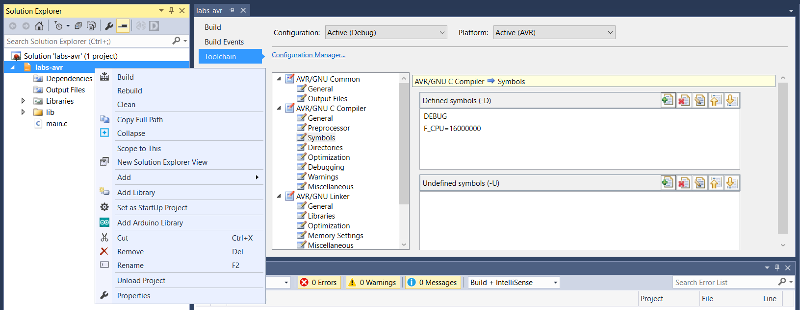
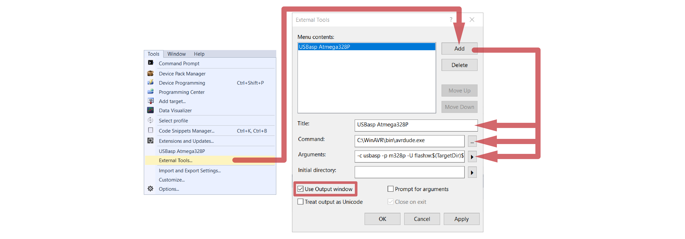
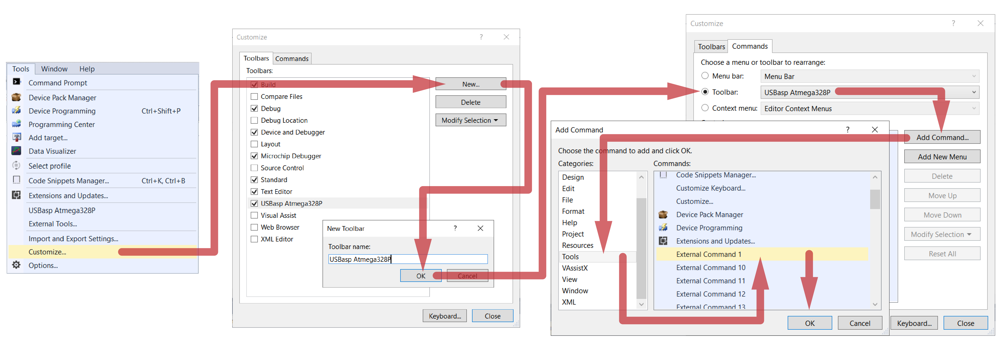
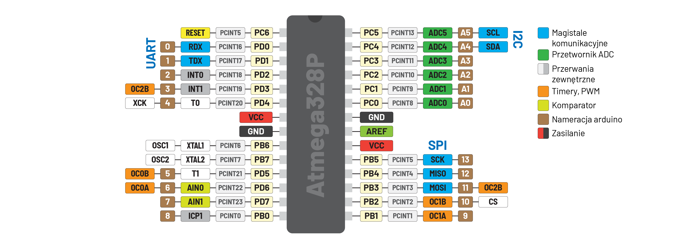

---
Emilian Świtalski | es@sqrt.pl
TODO: switch, lcd, ir
---

Kurs programowania procesorów **AVR** na przykładzie mikrokontrolera **Atmega328P**.

## Dlaczego AVR?

Mikrokontrolery wydane przez firmę Atmel nie są już aż tak popularne jak kiedyś i są powolutku wypierane. Jednak w mojej opinii taka Atmega jest lepszym procesorem na początek samodzielnej nauki niż zaawansowany STM32.

- Mamy ją w obudowie **DIP28** THT, więc możemy sobie na płytce stykowej wszystko sami poogarniać
- W sieci i literaturze można znaleźć masę przykładów i materiałów dotyczących tych mikrokontrolerów, z których zdecydowana większość dotyczy scalaków Atmega8A, Atmega32A oraz Atmega328P
- Mała różnorodność wykorzystywanych układów oraz niewielka ilość peryferiów i ich prostota, która w rozwiązaniach rynkowych jest dużym ograniczeniem, tutaj przekłada się na spójność przykładów. Jeden UART, niewielkie możliwości konfiguracji - wystarczy podłączyć i działa.

## Zawartość REPO

W paczce znajdziemy m. in.

- `apps` - Niezbędne oprogramowanie:
  - [Microchip AVR Studio](https://www.microchip.com/en-us/development-tools-tools-and-software/) - IDE
  - [WinAVR](http://winavr.sourceforge.net/download.html) - Paczka zawierająca aplikację do wgrywania firmware przez programator USB/ASP. Koniecznie trzeba zainstalować
  - [Zadig](https://zadig.akeo.ie/) - Program to aktualizacji programatorów USB/ASP
  - [Realterm](https://realterm.i2cchip.com/) - Terminal do komunikacji z PC
  - [CP210x](https://www.silabs.com/developers/usb-to-uart-bridge-vcp-drivers), [CH430](https://sparks.gogo.co.nz/ch340.html) - Sterowniki to kontrolerów USB
  - [AVRDudess](https://blog.zakkemble.net/avrdudess-a-gui-for-avrdude/) - Aplikacja do wgrywania wsadu oraz ustawiania fuse-bitów
- `template-ms` - Skonfigurowany projekt w **Microchip Studio**
- `template-vsc` - Skonfigurowany projekt w **Visual Studio Code**
- Przykładowe projekty zawierają bibliotekami do obsługi peryferiów mikrokontrolera i układów zewnętrznych:
  - `uart` - Interfejs komunikacyjny wykorzystywany m. in. do komunikacji USB
  - `pwm` - Układ generujący sygnał prostokątny
  - `adc` - Przetwornik analogowo-cyfrowy
  - `i2c` - Interfejs komunikacyjny wykorzystywany m. in. do komunikacji z czujnikami
  - `portx` - dodatkowe porty IO w tym wyświetlacze 7-segmentowe
  - `lcd` - Wyświetlacz ze sterownikiem HD44780

## Microchip Studio for AVR

Skonfigurowany projekt dla Microchip Studio znajduje się w folderze **template-ms**, jednak konieczna jest ustawienie prędkości pracy mikrokontrolera, gdyż jest ona ściśle związana z konfiguracją sprzętową _(fuse-bity / rezonator kwarcowy)_.



Aby pracować z programatorem **USB/ASP** trzeba dodać urządzenie zewnętrzne, ponieważ ten programator nie jest oficjalnie wspierany.



W polu `Command` należy wybrać ścieżkę do `avrdude.exe`

W polu `Arguments` należy wpisać

```
-c usbasp -p m328p -U flash:w:$(TargetDir)$(TargetName).hex:i
```



Na pasku narzędzi powinno pojawić się `USBasp Atmega328P`

Jak po z**build**owaniu program się nie wgrywa, trzeba przeinstalować sterowniki programatora


## Visual Studio Code

Z [Visual Studio Code](https://code.visualstudio.com/Download) sprawa wygląda prościej, gdyż konfiguracja programatora jest zawarta w projekcie **template-vcs**, a nie w IDE. Trzeba jedynie ustawić prędkość pracy jako definicję.

```cpp
#define F_CPU 16000000
```

I można skompilować i wgrać program za pomocą komendy

    make

# Speedrun AVR

Prezentacja obrazująca [operacje binarne](http://sqrt.pl/avr.pdf) często wykorzystywane w programowaniu systemów wbudowanych.

Wykorzystując płytkę stykową i scalak w obudowie DIP28 przydatna jest ściągawka z wyprowadzeniami mikrokontrolera.



## Migające diody LED

Zacznijmy klasycznie od migającej diody
W
Wymagane połączenia

- `PD3` ⟶ `LED`

```cpp
#include <avr/io.h>
#include <util/delay.h>

int main(void)
{
  // init();
  DDRD |= (1 << 3);

  while (1)
  {
    // loop();
    _delay_ms(200);
    PORTD |= (1 << 3);
    _delay_ms(200);
    PORTD &= ~(1 << 3);
  }
}
```

Teraz dodajmy 3 dodatkowe diody na różnych rejestrach. Niech migają na przemian w parach

Wymagane połączenia

- `PD3` ⟶ `LED1`
- `PD7` ⟶ `LED2`
- `PC2` ⟶ `LED3`
- `PB5` ⟶ `LED4`

```cpp
int main(void)
{
  DDRD |= (1 << 3) | (1 << 7);
  DDRC |= (1 << 2);
  DDRB |= (1 << 5);

  while (1)
  {
    _delay_ms(200);
    PORTD |= (1 << 3) | (1 << 7);
    PORTC &= ~(1 << 2);
    PORTB &= ~(1 << 5);
    _delay_ms(200);
    PORTD &= ~((1 << 3) | (1 << 7));
    PORTC |= (1 << 2);
    PORTB |= (1 << 5);
  }
}
```

Zmodyfikujmy programu z użyciem definicji określających pozycje diody w rejestrze. Kod staje się czytelniejszy i aby zmienić pozycję diody, wystarczy zmienić definicję

```cpp
#define LED1 (1 << 3)
#define LED2 (1 << 7)
#define LED3 (1 << 2)
#define LED4 (1 << 5)

int main(void)
{
  DDRD |= LED1 | LED2;
  DDRC |= LED3;
  DDRB |= LED4;

  while (1)
  {
    _delay_ms(200);
    PORTD |= LED1 | LED2;
    PORTC &= ~LED3;
    PORTB &= ~LED4;
    _delay_ms(200);
    PORTD &= ~(LED1 | LED2);
    PORTC |= LED3;
    PORTB |= LED4;
  }
}
```

Teraz zamrugajmy naprzemienne grupami czterech diod na jednym rejestrze. W tym przykładzie użycie definicji jak w poprzednim przykładzie jedynie przeszkadza. Gdy sterujemy 8 diodami z jednego rejestru, nie ma potrzeby wykonywać operacji nadpisywania `|=`, `&=`

```cpp
int main(void)
{
  DDRD = 0xFF;

  while (1)
  {
    PORTD = 0x0F;
    _delay_ms(200);
    PORTD = 0xF0;
    _delay_ms(200);
  }
}
```

Nieco lepiej jednak będzie ustawić stan początkowy oraz w pętli zmieniać stan wszystkich diod. Wówczas zmiana stanu początkowego zmieni efekt wizualny

Wymagane połączenia

- `PD[0..7]` ⟶ `LED[0..7]`

```cpp
int main(void)
{
  DDRD = 0xFF;
  PORTD = 0x0F; // PORTD = 0b10101010;
  while (1)
  {
    _delay_ms(200);
    PORTD ^= 0xFF; // PORTD = ~PORTD;
  }
}
```
<!---
Kolejnym zadaniem będzie stworzenie z diod LED świecącej linijki

Wymagane połączenia

- `PD[0..7]` ⟶ `LED[0..7]`

```cpp
#include <avr/io.h>
#include <util/delay.h>
#include <stdint.h>

int main(void)
{
  uint8_t value = 1;
  DDRD = 0xFF;

  while (1)
  {
    PORTD = ~value;
    _delay_ms(30);
    value <<= 1;
    if(!value) {
       value = 1;
    }
  }
}
```

Fajnie jakby linijka poruszała się raz w jedną, a raz w drugą stronę.

```cpp
#include <avr/io.h>
#include <util/delay.h>
#include <stdint.h>
#include <stdbool.h>

int main(void)
{
  DDRD = 0xFF;
  bool state = true;
  uint8_t value = 1;

  while (1)
  {
    PORTD = ~value;
    _delay_ms(30);
    if(state) {
      value <<= 1;
      if(value == 128) {
        state = false;
      }
    } else {
      value >>= 1;
      if(value == 1) {
      state = true;
      }
    }
  }
}
```
-->
## Komunikacja UART

Wymagane połączenia

- `PD0 (RX)` ⟶ `USB-TX`
- `PD1 (TX)` ⟶ `USB-RX`

```cpp
#include <avr/io.h>
#include <avr/interrupt.h>
#include "lib/uart.h"

int main(void)
{
  UART_Init(9600, 8, 0, 1);
  sei();
  while(1);
}

ISR(USART_RX_vect)
{
  char data = UART_Read();
  if(((data > 65) && (data < 88)) || ((data > 96) && (data < 120))) { data += 3; }
  else if(((data > 87) && (data < 91)) || ((data > 119) && (data < 123))) { data -= 23; }
  UART_Send(data);
}
```

## Biblioteka `portx`

Biblioteka zapewnia mam możliwość sterowania 8 dodatkowymi diodami `PINX`, przyciskami `PORTX`, a także 4 wyświetlaczami, do którego są przygotowane specjalne funkcje. Biblioteka w tle komunikuje się z rejestrami przesuwnymi za pomocą magistrali **SPI**.

Wymagane połączenia

- `PB5 (SCK)` ⟶ `SCK`
- `PB4 (MISO)` ⟶ `SO`
- `PB3 (MOSI)` ⟶ `SI`
- `PB2` ⟶ `CS`

```cpp
#include <avr/io.h>
#include <util/delay.h>

int main(void)
{
  uint8_t value = 0;
  PORT_Init();

  while(1)
  {
    _delay_ms(69);
    PORTY_Int(value);
    value++;
  }
}
```

## Przertownik ADC

Wymagane połączenia

- `PC0 (SCK)` ⟶ `POT` | `JOY` | `MIC` | `FT` | `...`

```cpp
#include <avr/io.h>

int main(void)
{
  uint16_t value = 0;
  ADC_Init();

  while(1)
  {
    _delay_ms(69);
    value = ADC_Run(0);
    // TODO: 'value' output
  }
}
```

## Enkoder

Enkoder wykorzystuje przerwanie zewnętrzne INT

Wymagane połączenia

- `PD2 (INT0)` ⟶ `ECR1`
- `PD3` ⟶ `ECR2`

```cpp
#include <avr/io.h>
#include <avr/interrupt.h>

#define ECR_LEFT 1 // 01
#define ECR_RIGHT 2 // 10

uint8_t ecr_left_right;

int main(void)
{
  uint8_t value = 0;
  PORTD = 0x0C;

  EIMSK |= (1 << INT0); // External interrupt 0
  EICRA |= (1 << ISC01) || ( 1 << ISC00 ); // Falling & rising edge
  sei();

  while(1)
  {
    if((ecr_left_right == ECR_LEFT) && (value != 0)) {
      value--;
      ecr_left_right = 0;
    } else if((ecr_left_right == ECR_RIGHT) && (value != 255)) {
      value++;
      ecr_left_right = 0;
    }
    // TODO: 'value' output
  }
}

ISR(INT0_vect)
{
  uint8_t state = (~PIND >> 2) & 3;
  if((state == 1)||(state == 2)) { ecr_left_right = ECR_RIGHT; }
  else if ((state == 0)||(state == 3)) { ecr_left_right = ECR_LEFT; }
}
```
